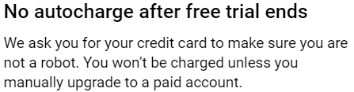

>Feb 2020 Update: This project has served its purpose and is no longer maintained. It is open source for educational purposes and now requires changes to function correctly. Namely, you can find examples of how to use https://github.com/tebeka/selenium and https://github.com/googleapis/google-cloud-go. If any [additional markup](./pkg/browser/selectors.go) changes are made to the GCP console they will not be detected by this client. If you have specific questions on how to do share credits across Google Cloud accounts, open an issue. Credentials found in the commit history of this project have been rotated.

# Cross-Project Billing (XPB) on Google Cloud Platform

<p align="center"><p>

Tired of paying Google to be your cloud provider? Want to use your mom's credit card without being charged for resources? Has your startup accelerator stopped giving you promo codes? Tired of migrating 50 Kubernetes clusters at the end of your $300 USD Google Cloud Platform trial quota? Have a side-hustle that needs *even more* free cloud infrastructure? Well look no further. XPB is for you!

## Expectations
- You have a GCP project with trial billing enabled (this requires a credit card, debit card, or bank account linked). Alternatively, you can use credits you've received from using a promo code.
- You are coming to the end of your $300 trial quota (not really necessary, but would defeat the purpose of the tool).
- You don't want to [Upgrade](https://www.youtube.com/watch?v=OmXuQxQ-4EE) your account to charge your linked credit or debit card (yay free stuff).

## Who does this benefit?
1. Startups that have been rejected from every cloud provider's Startup Program looking to lower their net burn rate.
2. Students experimenting a *little* too much.
3. Curious cloud developers.

<hr>
<h4 align="center">:warning: CAUTION :warning:</h4>

- If your billing account remains disabled for a protracted period, some resources might be removed from the projects associated with that account. For example: automatic shutdown of Google Kubernetes Engine clusters.
- If you associate an invalid or disabled billing account to the host's project, the project's resources will be deactivated.
- The free trial is a courtesy and should (not) be abused (often).
<hr>

## Notes & Disclaimers
- This is a side project I started for fun before joining AWS and should not be taken seriously; all "design choices", memes, and code are my opinion and do not reflect the views of my employer, or anyone else (just take a look lol).

- I am not responsible for what happens to your GCP resources while using this tool, directly or otherwise.

- This project is Google Cloud Platform specific. Keep in mind that projects and resources under a free trial billing account are not covered by GCP's Service Level Agreements. [See item 2.4 of the *Supplemental Terms and Conditions For Google Cloud Platform Free Trial*"](https://cloud.google.com/terms/free-trial/).

- If I've offended anyone at Google or broken any ToS regulations, feel free to [open an issue](https://github.com/swoldemi/xpb/issues) and send that cease and desist notice my way! This is *technically* AGAINST ToS because it violates the first "Condition" of the [*Supplemental Terms and Conditions For Google Cloud Platform Free Trial*, item 1.3](https://cloud.google.com/terms/free-trial/): 
```
The Free Trial starts when Customer creates a billing account in the Google Cloud Console (“Free Trial Start Date”) and ends on the earlier of (i) the date that Customer’s fees for usage exceeds $300 or (ii) 12 months from the Free Trial Start Date.
```

- This actually isn't 100% accurate, because your trial will NOT end after you hit $300, but will INSTEAD end at the end of the 365 day period, IF you add credits via cross-project linking or promo code. Use your trial account for experimentation and development, not profit. 


- You will still need to migrate accounts (or upgrade your account) at the end of the 365 day trial. Otherwise, all resources will be shutdown until a valid billing account is added to the project. It's time to learn [Terraform](https://github.com/hashicorp/terraform/)...

- If you mine crypto on cloud infrastructure, __I look down on you__ (~~unless it's Oracle's cloud~~). A majority of the time, mining software and unusual, long-term spikes in CPU usage will be detected and your project will be deleted after a warning. Don't waste your time. Be ethical.

## Usage
### Resource Requirements
1. A GCP account, on or off trial, with billing enabled. This account is referred to as the `host` account.
2. A second GCP account, on trial, with billing enabled. This account is referred to as the `guest` account.
    - **Important**: You may use the same billing method that was used in the first account. Example: same credit card on both accounts.

### Configuration
- This tool currently depends on the email and password for both the host and guest's GCP accounts. Additionally, it also uses Service account credentials to very some expectations of the host and gust accounts.
- For instructions on how to obtain service account credentials for the program see: https://cloud.google.com/iam/docs/creating-managing-service-account-keys

### Preliminary Setup
1. On the host account, create a service account at https://console.cloud.google.com/iam-admin/serviceaccounts/create?authuser=0&project=YOUR_PROJECT_NAME. Grant it the **Project Billing Manager** and **Project IAM Admin** roles, create a key, and download the key. It will be used for configuration. If the "0th" user (the `authuser` url parameter) that you are logged in to is not the account that owns the project you want to use, simply switch accounts. 
2. While still logged in as the host, enable the **Cloud Billing API** through the the GCP API Library dashboard (https://console.cloud.google.com/apis/api/cloudbilling.googleapis.com/overview) and the **Identity and Access Management** API through the GCP API Library dashboard (https://console.cloud.google.com/apis/api/iam.googleapis.com/overview).
3. Create your new GCP trial billing account. Ideally, this is done with an existing @gmail.com email account. Spam creating Gmail accounts is not a good idea.
    - When registering, make sure to set the `Account type` to individual. Fill in the name and address fields to match your billing information. If you prefer to have a different name and address than that which is linked to your billing account, for whatever reason, uncheck `Credit or debit card address is same as above` and fill in the information associated with the card.
    - Remember, you can use the same card that you are using for the trial billing account used for the host's project. Note: The `How you pay` component does say that you you are enrolled in `Automatic payments`, but you will only be charged for going outside of the $300 trial and manually agree to [Upgrade](https://www.youtube.com/watch?v=OmXuQxQ-4EE). Once you've signed up for the trial, a default project, named `My First Project` with some random Project ID, will be created for you and the trial account will be associated with it.
    
<p align="center">
 <br>
<span>Excerpt from the Free Trial sign up page.</span>
</p>

4. On the guest account, follow the same process to create a service account with permissions and enable the **Cloud Billing API** through the the GCP API Library dashboard (https://console.cloud.google.com/apis/api/cloudbilling.googleapis.com/overview) and the **Identity and Access Management API** through the GCP API Library dashboard (https://console.cloud.google.com/apis/api/iam.googleapis.com/overview). Depending on when you started your trial, ensure the default project (`My First Project` OR `Quickstart`) is the current project.

5. At this point, you need to download the correct ChromeDriver version, that matches your Chrome version. If you do not have Chrome installed, download it. This project currently only has code for Chrome based Selenium clients. You can download ChromeDriver here: https://chromedriver.chromium.org/downloads

6. Put the ChromeDriver binary, [selenium-server-standalone.jar](./bin/selenium-server-standalone.jar), your guest's service account keyfile, and your host's service account keyfile in a directory, then pass [configuration](./pkg/config/config.go) so that [XPB can use them](./main.go). Run `go run .` in your terminal.

## Contributing
If you are interested in contributing, the following would be greatly appreciated:
1. Sometime between July 2019 and Feb 2020, Google began detecting headless browsers when logging in at accounts.google.com, so it is no longer possible to login using a Selenium/WebDriver client. This could be replaced with an OAuth solution.
2. Update IAM assignments, such that, the bare-minimum privilege is granted to the guest's service account. If they are already at a state of least privilege (if you find an easier way of doing something), open a PR to edit this README!
3. Automatic enable of the Cloud Billing, and IAM APIs.
4. Automatic activation of the service accounts. Possibly calling `gcloud auth activate-service-account --key-file={path}` using package `os/exec` or the [respective googleapis/google-cloud-go](https://github.com/googleapis/google-cloud-go) libraries.
5. Automatic authentication of both guest and host via three-legged OAuth exchange through `gcloud auth login`. Might be possible to do without a webserver, using package `os/exec`, since the gcloud CLI already runs a webserver for the redirect (see https://github.com/swoldemi/xpb/blob/master/auth.go#L84-L92).
6. Verify that *both* service account keys may be revoked without any repercussions. Will the billing account become unlinked?
7. Better functionality of waiting for elements to load, instead of calling time.Sleep. The slower your internet or computer, the longer the sleep will need to be.

## Notes
- The fact that this project depends on `https://github.com/tebeka/selenium` which depends on `https://github.com/BurntSushi/xgb` is a complete coincidence.
- As of late June 2019, the non-organizational, GCP project used during the development of XPB is currently <100 days into the GCP trial, but has consumed over $700 in credits (~2.3 trial billing accounts worth)
- You can also use promo codes, albeit harder to come by, to your trial accounts. Promo codes are applied to accounts as an additional, auxiliary billing account.
- If you already have an additional GCP trial billing account, you may also use that. The Usage instructions go though setup using a fresh account just for convenience.

## FAQ
1. Does this actually work?
    - Yes! 
    - Feb 2020 edit: Not without a some fixes :()
2. Should I use Amazon Web Services, Google Cloud Platform, or Microsoft Azure?
    - Yes!
3. Why did you make this?
    - Why didn't you?
4. Couldn't I just use `gcloud alpha billing projects link`?
    - This does not work in cases where the account being used to call this endpoint does not own the billing account. It is also not possible to invite users across accounts, using only the GCP API, without some sort of browser automation and the manual accept of the email.
5. Are you still this bad of a programmer?
    - Improvise. Adapt. Overcome.